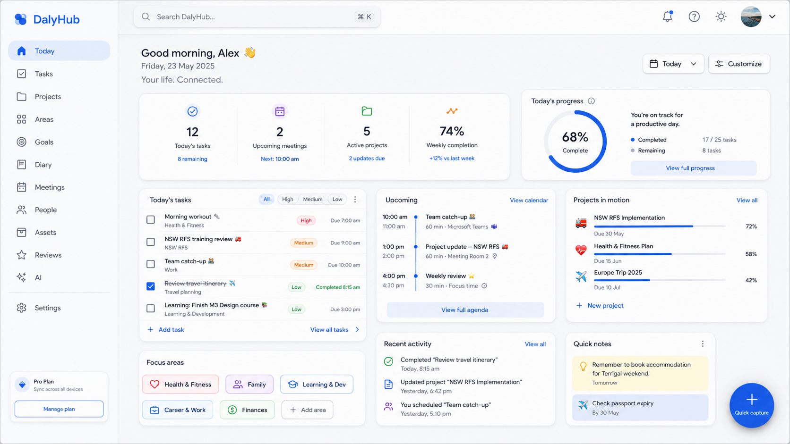

# Whole-product visual audit after PR #120

**Branch:** `claude/m3-visual-polish-6oq9z2` · **Base:** `main` @ `210e7d2` (PR #120, "Migrate to Material Design 3 and remove theme switching")
**Captured:** 6 August 2026 · **Status:** Gate A findings, with the resolved answers folded back in as the work lands.

PR #120 delivered the *technical* M3 foundation: one generated scheme from `#2563EB`, the
`--md-sys-*` / `--md-app-*` / `--app-*` vocabulary, Roboto Flex, Material Symbols geometry,
`scheme:check`, and the removal of the theme feature. This audit records what that foundation
does **not** yet do — turn the product into one coherent, polished design — and names, for each
surface, whether the cause is shared or module-local.

The finding in one sentence: **the token layer changed, the composition did not.** Almost every
surface is the pre-M3 DalyHub layout wearing new colour variables, and the three defects that
make it read as unfinished — a lavender canvas, a shell with no top app bar, and a single generic
row-card carrying the entire application — are all foundation-level, not module-level.

---

## 0. Baseline verification (before any change)

Run on unmodified `main` @ `210e7d2`.

| Check | Result |
|---|---|
| `pnpm run format:check` | **pass** |
| `pnpm run lint` | **pass** |
| `pnpm run typecheck` | **pass** |
| `pnpm run scheme:check` | **pass** — tokens.css and scheme.ts match the generator |
| `pnpm run test:unit` | **pass** — 312 files, 3798 tests |
| `pnpm run test:kernel` | **1 pre-existing failure** — 1 failed / 1944 passed of 1945 |
| `pnpm run build` | **pass** |

### Pre-existing failure (not caused by this work)

```
test/kernel/task-recurrence-route.test.ts
  > route: completing and undoing a recurring task
  > reports the successor it created, then withdraws it on undo
AssertionError: expected '2026-08-13' to be '2026-08-06'
  at test/kernel/task-recurrence-route.test.ts:287
```

This is a **date-dependent test**, not a regression. The assertion hard-codes `2026-08-06` as the
successor's scheduled date. Today *is* 2026-08-06, so the weekly recurrence rolls the successor
forward to the following week and the fixed expectation no longer holds. It fails on this date on
`main` with no changes applied.

It matters because the follow-up work has to leave `verify` green at branch head, and `verify` cannot be green while
a wall-clock-dependent assertion is in the suite. **Proposed:** pin the test's clock to a fixed
instant (the pattern the rest of the suite already uses for date maths) rather than relaxing or
skipping the assertion. This is a genuine fix, not a weakening — it makes the test deterministic
and keeps the guarantee it was written for.

**Resolved.** Fixed on its own commit, separate from the visual work because it is unrelated to it.
Only the repository the test builds directly had a `FakeClock`; the ROUTE composes its own
repository from the environment and read the real system clock. The clock is now pinned to the same
instant, scoped to the single test — the sibling "RETAINS an edited successor" case tells an edited
successor from an untouched one by its timestamps, and a frozen clock makes those
indistinguishable.

### PR #120 regressions guarded against

All five confirmed present on `main` before starting:

| Fix | Evidence |
|---|---|
| Corrected preferences upsert | `ON CONFLICT (workspace_id, owner_id) DO UPDATE SET` — `app/platform/storage/d1/d1-app-preferences-repository.ts:117` |
| Planned-task summary links | `/tasks?planned=planned_today`, `/tasks?planned=planned_earlier` — `app/modules/today/landing/widgets.tsx:601,612` |
| Bounded-count honesty guard | `countsComplete` derived and consumed — `app/modules/today/landing/load.ts:88,458,462`; `types.ts:149` |
| Today task-summary denominator | Inbox excluded from the ring's denominator — `app/modules/today/landing/insights.ts` |
| Light-mode card/page surface | `app-surface-card` (#ffffff, tone 100) is lighter than `app-surface-page` (#f2f3ff, tone 96) |

---

## 1. Root cause A — the lavender wash is a *chroma* problem, not a tone problem

The tone ordering PR #120 established is broadly correct. The chroma is not.

Measured with HCT over the committed scheme (`app/shared/tokens/scheme.ts`):

| Surface | Light hex | Hue | **Chroma** | Tone |
|---|---|---|---|---|
| `app-surface-page` | `#f2f3ff` | 269° | **9.01** | 96.1 |
| `app-surface-card` | `#ffffff` | 209° | 2.87 | 100.0 |
| `app-surface-raised` | `#e6e7f5` | 272° | **10.16** | 91.9 |
| `app-surface-sunken` | `#ecedfb` | 272° | **10.12** | 94.0 |
| navigation (`surface`) | `#faf8ff` | 274° | 5.60 | 97.9 |

| Surface | Dark hex | Hue | **Chroma** | Tone |
|---|---|---|---|---|
| `app-surface-page` | `#10131c` | 270° | **9.87** | 6.0 |
| `app-surface-card` | `#1d1f29` | 275° | **10.12** | 12.0 |
| `app-surface-raised` | `#272a34` | 270° | **10.08** | 17.2 |
| `app-surface-sunken` | `#191b25` | 276° | **10.22** | 10.0 |
| navigation (`surface`) | `#10131c` | 270° | **9.87** | 6.0 |

**Why.** ADR-074 chose `SchemeVibrant` so the *primary* would keep the seed's confidence rather
than collapsing to `SchemeTonalSpot`'s muted navy. That was the right call for the primary — and
it also set the scheme's **neutral palette to chroma 10**. Every rung of the neutral ramp comes
out at chroma ≈ 10:

```
neutral tone  96 -> #f2f3ff  chroma=9.01     neutral tone 12 -> #1d1f29  chroma=10.12
neutral tone  97 -> #f6f5ff  chroma=7.51     neutral tone 17 -> #272a34  chroma=10.08
neutral tone  98 -> #faf8ff  chroma=5.60     neutral tone  6 -> #10131c  chroma= 9.87
```

At tone 96 in the light scheme, chroma 9 at hue 269° is a *visible violet*, and it is painted
across the entire page canvas, every filter bar, every sunken panel and every raised surface. The
only genuinely neutral surface in the product is the card — and only because it is pure white.

**Two further consequences, both visible in the captures:**

1. **Dark navigation is invisible.** `app-surface-page` and the drawer both resolve to `surface`
   (`#10131c`) in dark. The navigation drawer and the page are *the same colour* — there is no
   tonal step separating them at all (`desktop-1440-dark/today.png`).
2. **Only four app surfaces exist.** There is no `surface-navigation`, no `surface-app-bar` and no
   `surface-card-subtle`, so the shell has nothing to paint with and modules reach for raw
   `--md-sys-color-surface-container-*` rungs instead — which is why the drawer, the mobile bar and
   the bottom nav each pick a different rung by hand.

**Shared fix, as implemented.** `scripts/generate-m3-scheme.mjs` emits the seven application
surfaces plus a card hairline from their own generated **app-neutral palette**, at the tones in
Appendix A.1.

Lowering the chroma turned out to be necessary but not sufficient. The seed's HCT hue is 272°, which
sits on the MAGENTA side of blue, so a low-chroma ramp at that hue reads as a faint lilac rather
than as a cool grey:

```
seed hue 272°, chroma 3:  tone 97 #f8f5f9   tone 98 #fbf8fb    (R > B — warm)
seed hue 272°, chroma 4:  tone 97 #f8f5fa   tone 98 #fbf8fd    (R > B — warm)
reference canvas          #f7f8fa           hue 229°, chroma 3.9, tone 97.6  (B > R — cool)
```

The palette therefore carries TWO documented constants rather than one — a hue rotation toward the
cool end and a chroma reduction — and nothing else:

```js
TonalPalette.fromHueAndChroma(sourceHct.hue + APP_NEUTRAL_HUE_ROTATION, APP_NEUTRAL_CHROMA)
//                             272.2°       + (−35°)                  , 4
```

That puts tone 97.5 on `#f7f8fa` — the reference canvas exactly. No hex is authored; `scheme:check`
still fails the build on a hand-edit. Shipped values are chroma 2.9–4.3 across all seven surfaces in
both appearances, against 9.0–10.2 before.

## 2. Root cause B — there is no desktop top app bar

`.dh-mobilebar` is `display: none` above 48rem (`app/styles/shell.css:454`, `:923`). The desktop
shell is a two-column grid — rail + pane — and nothing else. Consequences visible everywhere:

- **Search lives in the sidebar** as a 56 px fully-rounded pill, with a second, equally prominent
  56 px "Command palette" pill directly beneath it. Together they consume 112 px at the top of the
  navigation drawer before a single destination appears — see Appendix A.2, which places the primary
  search in the top app bar and allows no second control of equal prominence in the drawer.
- Every page's own header has to double as the application bar, which is why `.dh-pane-header`
  carries the primary action, and why records — which use `RecordLayout`'s own header instead —
  end up with a **second, incompatible header system** (measured: `.dh-pane-header` is absent on
  `/projects/:id`, `/areas/:id`, `/settings`, `/ai`, `/help`, `/about`).
- Utilities (help, user menu, appearance) have nowhere to live, so the user menu is pinned to the
  bottom of the drawer.

## 3. Root cause C — one generic row-card carries the whole product

`app/shared/card` exposes a single `Card` with `list | grid | board` collection variants. **35 of
the 60 stylesheets in `app/styles` independently paint `--md-app-color-surface-card`**, and
`today.css` (2 236 lines) and `settings.css` (788 lines) between them declare 18 bespoke
card-radius blocks. That is not a shared card family; that is one component plus 35 forks.

Measured median card heights at 1440 × 900 (light):

| Route | Cards | Median height | Note |
|---|---|---|---|
| `/tasks` | 50 | **64 px** | one-line task in a 64 px row inside a bordered card |
| `/projects` | 50 | 59 px | full-width row, 1400 px wide |
| `/areas` | 9 | 60 px | full-width row, 1400 px wide |
| `/today` | 36 | 63 px | plus a 250 px hero and a 290 px task-summary card |
| `/people` | 2 | 100 px | |

---

## 4. The audit table

Legend for **Shared cause**: **A** = lavender/chroma + missing app surfaces · **B** = no desktop top app bar · **C** = single generic card · **D** = `PaneHeader` too thin (no icon/eyebrow/metadata/status slots) · **E** = `CollectionLayout` forces header → filter row → card list · **F** = no shared form/field M3 anatomy · **G** = no entity identity (icon container) primitive.

| Surface | Current structure | Current visual problem | Shared cause | Module-specific cause | Proposed shared fix | Proposed module fix |
|---|---|---|---|---|---|---|
| **Today** | Pane header + "Customise" row + collapsible widget regions (hero / primary / secondary) | Lavender canvas; 250 px hero with a 6-tile outlined grid and large dead space; 290 px task-summary card for a ring + 3 legend rows; `▾ Brief`, `▾ Task summary`, `▾ My day`, `▾ Insights` disclosure triangles above every card read as a debug view; greeting says **"Good afternoon, Local."**; FAB overlaps the Insights card | A, B, C, D | `today.css` (2 236 lines, 10 bespoke card blocks); region-based placement model; metric tiles are individually **outlined** boxes | Neutral surfaces; top app bar; `DashboardCard` + `MetricTile` (divider, not outline, no per-tile elevation) | Replace regions with a responsive 12-column dashboard; move personalisation into card overflow + Customise; resolve the real display name; four rows per Appendix A.4 |
| **Tasks** | Pane header (96 px) + view switcher + "View All active" row + "Filter & sort" row + quick-add + card list | ~300 px of chrome before the first task; rows 77 px for one line of content; every row shows a green check glyph *and* a checkbox; heavy pink overdue pill on every row; status chip competes with it; rows stretch 1400 px; no grouping headers | A, C, E | `task-signals.css`; four separate control rows the module composes itself | `RecordRow` (56 px one-line / 64–72 px two-line); collection `rows` presentation; compact subordinate filter bar | Collapse four control rows into one toolbar; group by planned/overdue/inbox; drop the duplicate check glyph; constrain row measure |
| **Projects collection** | Pane header + segmented filter + full-width row cards | Identical to Tasks and Areas — "the same generic card list"; no project icon; progress bar unlabelled (`1 of 2 tasks`, no %); run-on metadata line; **"Updated: Updated 19 Jul 2026"** duplicated label; two competing status systems (state chip right, health chip inline) | A, C, E, G | `projects.css` is only 105 lines — too thin to compose anything intentional | `EntityCard`; collection `cards` presentation; `RecordIcon` | 3/2/1-column responsive grid; selected icon; progress + percentage; single status treatment; fix the duplicated "Updated:" label |
| **Project record** | `RecordLayout` header + summary card + tabs + nested task panel | No identity icon; ~230 px summary card with an empty right half; **health stated 3×** (header chip, bar chip, "No progress in 18 days"); **progress stated 3×**; Area stated 2×; nested shadowed card inside a card; ~250 px of empty canvas below | A, C, D | `record-layout.css` summary grid always renders all columns even when empty | Record identity header (icon + eyebrow + title + parent + status + metadata); inset panels instead of nested cards | De-duplicate health/progress/Area; drop empty summary cells; contextual side column |
| **Areas collection** | Same generic row card | Area identity is an **8 px coloured dot** + generic diamond glyph; repeated **"Goals: No goals yet · Projects: No Projects yet · Tasks: No tasks yet"** on 4 of 9 rows; "Permanent" chip on every row (every Area is permanent); ragged alignment where some rows have progress bars and some don't; large empty canvas below | A, C, E, G | `areas.css` (129 lines) | `EntityCard` tile presentation; 40 px accent icon container | Reference-style Focus Areas tiles; selected icon on Area accent; one concise "No active work" state; drop the Permanent chip |
| **Area record** | `RecordLayout` | No identity icon; same empty-summary-cell problem | A, C, D, G | — | Record identity header | Area accent container + selected icon |
| **Goals collection / record** | Same generic row card | Indistinguishable from Projects | A, C, E, G | `goals.css` is 63 lines | `EntityCard` | Goal-specific anatomy: target date, linked active projects, next action |
| **Notes collection** | Row cards | Single 78 px card; no excerpt; no visible modified time hierarchy | A, C, E | — | `RecordRow` two-line | Title + excerpt + modified + tags |
| **Notes editor** | CodeMirror + toolbar | `markdown-editor.css` (613 lines) declares 5 bespoke card blocks; borders around every region | A, C | Editor chrome authored independently | Shared surfaces | Calm toolbar; readable measure; metadata out of the writing surface |
| **Diary** | Collection layout, no cards rendered | No date-led grouping; entries would be generic cards | A, C, E | `diary.css` (793 lines) | Timeline/`TimelineItem` | Date-led presentation, current-day emphasis |
| **Meetings** | Collection layout, no cards rendered | No agenda/time column | A, C, E | `meetings.css` (291 lines) | `TimelineItem` | Agenda rows: time, duration, method, participants, follow-up |
| **People** | Row cards, 100 px | Same generic entity glyph for every person; initials available and unused | A, C, G | `people.css` (443 lines) | Avatar/initial container primitive | Initials avatar, relationship, last interaction |
| **Assets** | Row cards | Single 80 px card; state chips not distinguishable without colour | A, C, E | `assets.css` (754 lines, 5 bespoke card blocks) | `EntityCard` | Category icon, renewal state, next due, restrained warning treatment |
| **Reviews** | Collection, no cards rendered | Empty review cards | A, C, E | `reviews.css` + `review-guide.css` (827 lines combined) | `DashboardCard` | Period, status, progress, sections, one CTA |
| **AI** | `.dh-coming-soon` placeholder in a bordered box | Honest, but visually detached from the product | A | `ai.css` (392 lines) | App surfaces | Conversation surface, composer, suggestion chips — no faked capability |
| **Settings** | Settings nav column + `h1` outside `PaneHeader` + white bordered cards | Native `<select>` with browser arrow beside designed controls; **"Default task destination" label rendered twice**; input clipped mid-word; large dead band under the description; no `PaneHeader`; content measure not aligned with other routes | A, D, F | `settings.css` (788 lines, 8 bespoke card blocks) | Shared page header; M3 select; consistent field anatomy | Consistent row rhythm; bounded control width; danger zone separated |
| **Help / About** | `.dh-pane-body` prose | 13 939 px tall page with no contents navigation | A, D | `help.css` (247 lines) | Shared page header | Contents list; callouts; version block |
| **Search overlay** | Overlay listbox | Results are not compact entity rows | A, C, G | `search.css` (364 lines) | `RecordRow` + `RecordIcon` | Entity icon, type, match highlight |
| **Command palette** | Overlay | Sized and grouped independently of the rest of the system | A | `command.css` (458 lines) | Raised app surface | Grouped commands, keyboard hints |
| **Create/edit forms** (drawer-hosted) | Label-above-box fields | 672 px drawer for two fields with ~550 px empty; no M3 outlined anatomy, no floating label; bare red `*`; action bar floats mid-panel rather than a stable footer; square leading corner | A, F | Each module composes its own form body | M3 outlined field + floating label + supporting/error text; stable drawer footer; extra-large leading corner | One-column field groups; two columns only where fields pair |
| **Drawers** | Right side panel | Header has no leading icon; body/footer not separated; large empty panel | A, F | `drawer.css` (342 lines) | Width by content; stable footer; raised surface | — |
| **Sheets (mobile)** | Bottom sheet | Reachable, but same field anatomy problem | A, F | `sheet.css` (324 lines) | Shared field anatomy | Keyboard-inset handling verified |
| **Mobile shell** | Top bar + bottom nav + FAB | **Route title duplicated** — "Today" in the top bar and again in the pane header directly beneath; **FAB overlaps card content** (sits on the Task summary card's "All tasks" link) | B, D | — | Publish the title once; reserve the FAB band | — |
| **Mobile Today** | Stacked widgets | Hero + 6 outlined tiles fill the entire first viewport; no task content above the fold | A, C, D | `today.css` | `MetricTile`; compact eligibility in layout metadata | Reorder so real work is above the fold |
| **Empty / filtered-empty** | `EmptyState` centred in the collection | Occupies a full viewport band for one line of text | A, C, E | `empty-state.css` (107 lines) | Proportionate empty state inside the content card | Concise Area/Project states — one "No active work" line, not three absence messages |
| **Offline** | Own shell | `offline.css` (656 lines) independent of the app surfaces | A | — | App surfaces | — |

---

## 5. The findings, named explicitly

**Surfaces that are merely token-swapped versions of the old design.** Tasks, Projects, Areas,
Goals, Notes, Assets, People — all seven render the same `Card` in the same `CollectionLayout` in
the same header → filter → list order they did before PR #120. Only the hexes changed.

**Cards too tall for their content.** Today hero (250 px for a greeting and six numbers); Today
task summary (290 px for a ring and three legend rows); Project record summary (230 px, right half
empty); Tasks rows (77 px for one line).

**Rows that stretch too widely.** Tasks, Projects and Areas rows run the full 1 400 px content
width at 1440, with the title at the far left and the status chip at the far right and nothing
between them.

**Inconsistent card headers.** `.dh-pane-header` on collections; `RecordLayout`'s own header on
records; a bare `<h1>` on Settings, Help, About and AI; a `▾ label` disclosure row on every Today
widget. Four header systems.

**Duplicated actions.** Search *and* Command palette as twin 56 px pills; the FAB *and* the
"Quick capture" button both present on Today; "New Project" in the header and again in both empty
states.

**Weak hierarchy.** Project rows read as an undifferentiated run-on line: `DalyHub V2 · [bar] ·
1 of 2 tasks · Health: Stale · No progress in 18 days · Updated: Updated 19 Jul 2026` — six facts
at one weight.

**Excessive outlines.** Today's six metric tiles are individually outlined boxes inside an
outlined card; Settings cards carry a border *and* sit on the tinted page; `base.css` gives every
native control a full `--md-sys-color-outline` border.

**Excessive purple tint.** Quantified in section 1 — chroma 9–10 on every app surface except the white card.

**Poor light/dark tonal separation.** Dark navigation and dark page are the identical hex.

**Oversized filter areas.** Tasks spends ~300 px above the first row across four separate control rows.

**Inconsistent icon presentation.** Sidebar entity icons are a full colour rainbow; Area identity
is an 8 px dot; Projects and Goals get a 16 px monochrome outline glyph; People get the same
generic glyph for everyone.

**Missing entity identity.** No Area or Project can carry a chosen icon at all — the feature does
not exist yet; selectable Area and Project icons are Appendix A.3.

**Generic record pages needing a stronger header.** Project, Area, Goal, Person and Asset records
all open with an eyebrow, a title and a chip, with no icon and no identity container.

**Desktop layouts still behaving like enlarged mobile layouts.** Project record: a single centred
column with 250 px of empty canvas beneath it at 1440 × 900. Areas: nine full-width rows and then
nothing. Neither uses the second dimension.

**Empty states occupying too much space.** The filtered-empty state fills the whole collection band.

**Module CSS fighting shared CSS.** 35 stylesheets paint `--md-app-color-surface-card`
independently; `today.css` is 2 236 lines.

**Module CSS too thin to provide an intentional composition.** `projects.css` 105 lines,
`goals.css` 63, `areas.css` 129 — three of the product's most important collections have almost no
composition of their own and therefore inherit the generic list wholesale.

**Component DOM anatomy that cannot produce the reference design.** `Card` has no slot for an icon
container, a primary metric, a footer action or a progress percentage. `PaneHeader` has no slot for
a leading icon, an eyebrow, summary metadata or a compact status. Neither can be styled into the
reference; both need new anatomy.

---

## 6. Screenshot index

All captures are current-state, on unmodified `main` @ `210e7d2`.

- **Data source:** local Miniflare D1, `local-dev-workspace`, seeded by `e2e/setup-local-db.mjs`
  + `e2e/seed-tasks.sql` (9 Areas, 50 Projects, 50+ Tasks, Goals, Notes, Diary, Meetings, People,
  Assets, Reviews). Identity is the development authenticator (`DEV_AUTH_NAME=Local Developer`) —
  which is why the greeting renders "Good afternoon, Local."
- **Server:** `react-router dev` on `http://localhost:4173` (the same Workers runtime as production).
- **Appearance:** emulated via `prefers-color-scheme`, which is the only selector that exists (ADR-074).
- **Tests run before capture:** the full baseline in section 0.
- **Root:** `docs/design/assets/m3-polish-2026-08/audit/`

| Set | Viewport | Appearance | Contents |
|---|---|---|---|
| `desktop-1440-light/` | 1440 × 900 | light | today, tasks, projects, project-record, areas, area-record, goals, goal-record, notes, diary, meetings, people, person-record, assets, reviews, ai, settings, help, about, search; `--full.png` full-page variants for the nine surfaces whose vertical proportion is itself the finding |
| `desktop-1440-light/` (interactive) | 1440 × 900 | light | drawer-new-project, drawer-new-area, drawer-task, command-palette, search-overlay, capture-desktop, empty-filtered-tasks, empty-filtered-projects, record-empty-project, offline |
| `desktop-1440-light/` (fixtures) | 1440 × 900 | light | `fixture-*` for the ten dev-only `/design/*` component routes |
| `desktop-1440-dark/` | 1440 × 900 | dark | today, tasks, projects, settings, areas, project-record, meetings, notes |
| `laptop-1280-light/` | 1280 × 800 | light | today, projects, tasks |
| `tablet-1024-light/` | 1024 × 768 | light | today, projects, tasks |
| `mobile-390-light/` | 390 × 844 | light | today, tasks, projects, areas, project-record, mobile-nav-sheet, mobile-capture-sheet, mobile-drawer-new-project, mobile-drawer-new-area, mobile-tasks-top |
| `mobile-390-dark/` | 390 × 844 | dark | today, tasks |

`measurements.json` accompanies the captures with the computed background colours, header heights,
sidebar/nav/search metrics, card counts and median card heights quoted throughout this document.

### Known mismatches and gaps in this capture set

- `/projects/new`, `/areas/new` and `/tasks/new` are **action-only resource routes** with no
  loader; a GET returns a router error. Create forms are reached through the shared Drawer, and are
  captured that way (`drawer-new-project`, `drawer-new-area`).
- `/search` is a JSON resource route, not a page. Search is an overlay, captured as `search-overlay`.
- Diary, Meetings, Reviews and Person record render no `.dh-card` in the seeded workspace, so their
  populated-state audit is based on layout and module CSS rather than on rendered cards. A richer
  local seed is proposed before Gate D so those three collections can be judged populated.

### Accessibility concerns already visible (to be confirmed with axe)

- **FAB overlaps content** on mobile Today — a 56 px control sitting over an interactive link is a
  target-size and occlusion problem, not only a visual one.
- **Duplicated page title** on mobile gives two `h1`-level announcements of the same route.
- **"Updated: Updated"** and the duplicated "Default task destination" label are announced twice.
- **Status conveyed partly by chip colour** on Projects/Tasks — the text is present, so this is
  likely compliant, but the overdue pill's weight makes colour the dominant signal.
- Dark navigation being the same colour as the page removes the only non-semantic cue that the
  drawer is a distinct region.

---

## 7. What I propose to do about it, in order

This is the commit sequence (restated in full in Appendix A.5). Nothing below is committed yet.

1. **`design: generate neutral application surfaces`** — seven generated app surfaces at low
   chroma; structural tokens; contrast, chroma and surface-ordering tests.
2. **`shell: rebuild desktop and mobile application chrome`** — desktop top app bar with the
   primary search; compact navigation drawer; one page title; FAB band.
3. **`design: expand shared headers cards rows and layouts`** — `PaneHeader` slots; the five-member
   card family; `CollectionPresentation` modes; record identity header; form/drawer/sheet anatomy.
4. **`entities: add selectable area and project icons`** — migration, catalogue, picker, full
   persistence coverage.
5. **Modules**, in the brief's grouping.
6. **`today: rebuild the reference-led dashboard on real data`** — including the exact-count
   exact-count aggregate methods described in Appendix A.4.
7. **Responsive, accessibility, documentation.**

---

## 8. Open questions for approval

1. **The reference mock-up** is checked in at
   [`assets/m3-polish-2026-08/reference/dalyhub-dashboard-reference.png`](assets/m3-polish-2026-08/reference/dalyhub-dashboard-reference.png).
   Appendix A still restates everything the implementation depends on, so the requirements survive
   independently of the image.
2. **The date-dependent kernel test** (section 0) — approval to fix it properly with a pinned clock, so
   `verify` can be green at branch head.
3. **A richer local demo seed** for the three collections that render empty (Diary, Meetings,
   Reviews), local-only and uncommitted unless you would rather it became a committed dev fixture.
4. **App-neutral hue** (section 1) — I will bring a light/dark comparison at Gate B rather than choosing
   between the seed hue and a cooler generated hue without pixels.


---

## Appendix A — the design direction this audit is measured against

This appendix exists because the audit above was written against a brief supplied in a chat
session, and AGENTS.md §0 is explicit that **the repository, not a session, is the long-term
memory of the product**. Everything the follow-up work depends on is restated here, so a future
implementer needs nothing but this file.

Where a value came from the reference mock-up it is marked *(measured)*; where it came from the
written direction it is marked *(specified)*.

**The reference:**
[`assets/m3-polish-2026-08/reference/dalyhub-dashboard-reference.png`](assets/m3-polish-2026-08/reference/dalyhub-dashboard-reference.png)
— a Today dashboard showing the intended shell, surface and card language. It is the authoritative
visual reference for the whole product, not only for Today: the drawer, the top app bar, the card
family, the metric row, the timeline and the entity-icon treatment it shows are what every other
surface is being brought into line with.



### A.1 Application surfaces

Generated, never authored, from the same `#2563EB` seed as everything else. The palette is
`TonalPalette.fromHueAndChroma(seedHue + rotation, chroma)`; only those two numbers are constants.

| Role | Light tone | Dark tone |
|---|---|---|
| `surface-page` | 97–98 | 6–8 |
| `surface-navigation` | 99 | 8–10 |
| `surface-app-bar` | 99–100 | 9–11 |
| `surface-card` | 100 | 12–14 |
| `surface-card-subtle` | 96 | 10–12 |
| `surface-raised` | 100 *(separated by elevation, not tone)* | 17–20 |
| `surface-sunken` | 93–95 | 5–7 |

Exact tones may move where contrast requires, but the ORDER is the contract. Required properties,
all asserted in `test/unit/tokens`: cards visibly lighter than the page in both appearances;
navigation and the app bar distinguishable from the page; sunken visibly recessed; raised never
darker than a card; every app surface low-chroma; all text, UI, focus-ring and chart-track contrast
still passing.

Reference values *(measured)*: page canvas `#f7f8fa` (HCT hue 229°, chroma 3.9, tone 97.6); cards,
navigation and app bar all `#ffffff`; card hairline ≈ `#e9ebef` (tone 93); selected navigation pill
≈ `#eef2ff`. Note that the seed's own hue is 272°, which is on the magenta side of blue — a
low-chroma ramp at that hue reads lilac, not cool grey, which is why the palette carries a hue
rotation as well as a chroma reduction.

**Colour usage** *(specified)*: primary blue for the main action, active progress, links, focus,
selected navigation, today indicators and blue chart series. Custom colours only for meaningful
identity or state (overdue, warning, completed, waiting, project/Area identity, charts). Large
ordinary cards are never painted blue, and tinted surfaces stay a minority of the page.

### A.2 Shell anatomy *(specified, corroborated by the reference)*

- Permanent navigation drawer at the left, 232–248px; desktop top app bar across the content
  region, 64–72px; page content beneath, with no dead band between bar and page.
- Separation by tone, not by heavy borders.
- Navigation rows: 48–52px visual, 44px minimum target, 24px icon, 12px icon-to-label gap,
  full-rounded selected indicator, `secondary-container` / `on-secondary-container` when selected,
  `on-surface-variant` when not. No coloured icon rainbow unless each colour carries established
  semantic meaning.
- Primary search lives in the TOP APP BAR: 480–560px, 52–56px tall, full-rounded, tonal background,
  leading icon, placeholder, trailing shortcut hint, no resting outline, clear focus ring, shrinking
  before any utility control disappears. No second control of equal prominence in the drawer.
- Top-bar utilities use only real existing functions — no notification bell unless a notification
  system exists, no plan or billing entry, and an appearance indicator only where it reports the
  operating-system appearance rather than offering an editable theme.
- Mobile: 64px top bar, safe areas, bottom navigation with an active-indicator pill and persistent
  labels, capture FAB above the bar, no overlap with content, and **no duplicated page title**.

Structural targets: desktop page gutter 28–32px, tablet 20–24px, mobile 16px; dashboard gaps 20–24px
on desktop; card padding 20–24px standard and 16px compact; card radius `corner-large` with nested
panels at `corner-medium`; list rows 56px one-line and 64–72px two-line; desktop buttons 40px visual
in a 44px target; entity icon container 36–40px with a 20–24px glyph; progress bars 4px.

### A.3 Selectable Area and Project icons *(specified)*

Nullable `icon_key` on Areas and Projects, storing a controlled semantic key only — never SVG, HTML,
an icon-font codepoint, a component name, a URL, arbitrary text or an emoji. Existing records stay
valid with no backfill; Areas fall back to the Area icon and Projects to the Project/folder icon. One
shared key type and catalogue (key, label, category, icon component, search terms), every key
resolving to an icon already exported through the existing `createIcon` API, keys stable even if the
path changes. One shared picker used by both Create/Edit Area and Create/Edit Project: current
preview, search, category groups, grid, visible names, selected state, reset to default, 44px
targets, keyboard selection, Escape closes, focus returns to the trigger, selection conveyed by
check/shape and ARIA rather than colour alone. An unknown stored key renders the fallback and must
never break SSR. Icon keys must survive repositories, validation, loaders, actions, import, export,
workspace snapshots and cloning — never silently discarded.

### A.4 Today *(specified, corroborated by the reference)*

A responsive 12-column dashboard replacing the hero/primary/secondary region model, with layout
metadata per widget (default span, order, desktop row priority, tablet span, mobile order, compact
eligibility). Stable widget IDs and personalisation data are preserved; persisted local layout is
versioned and normalised rather than silently reset. Personalisation controls move into the card
overflow menu and the Customise interface — the resting dashboard must not look like a debug view of
draggable widgets.

- **Row 1** — Daily summary (cols 1–8): four equal metrics (today's tasks, upcoming meetings, active
  projects, weekly completion), each a small tonal icon container, a strong value, a label and one
  actionable supporting line, separated by internal dividers with no per-tile shadow or outline.
  Today's progress (cols 9–12): progress ring, clear denominator, completed and remaining, one
  concise interpretation, a real destination.
- **Row 2** — Today's tasks (1–5, ~5 rows, checkbox/title/context/priority/time, Add task, View all);
  Upcoming agenda (6–8, merged scheduled tasks and meetings, time, timeline, duration and kind);
  Projects in motion (9–12, 3–4 active projects with icon, progress and percentage).
- **Row 3** — Focus Areas (1–5, compact selected-icon items); Recent activity (6–8, real activity with
  correctly resolved actor names); mini calendar or Quick Notes (9–12) on real data.
- **Row 4** — three equal analytics cards: meeting hours (real durations, weekly area chart), tasks
  completed (real daily completions, seven-day bars, prior-period comparison), productivity score
  (documented formula, ring, explanation, footnote).

**Metric honesty is the hard rule.** Exact-looking totals are never derived from bounded preview
arrays. Where a kernel exposes only bounded lists, add a read-only aggregate/count through the
existing repository and kernel architecture (no new schema is needed for dashboard counts) and
return either an exact count or an explicitly-marked lower bound. Never imply completeness. Day
bucketing uses the owner's timezone and first-day-of-week preference. The greeting uses the real
owner display name — never "Local", "Someone" or a generic label.

**Charts** are hand-built SVG primitives (progress ring, spark area, week bars) with no runtime chart
dependency: typed data, responsive viewBox, zero baseline where relevant, chart tokens only, legible
dark track, no misleading scale, reduced-motion safe, `role="img"` with a generated text
alternative, an empty state, and no clipping at zero or full.

### A.5 Commit sequence and approval gates *(specified)*

Visual work is shown before it is committed. For each unit: make the change, run its tests, run the
app on realistic local data, capture the screenshots, present them with full paths, viewport,
appearance, route, data source, tests run, known mismatches and open accessibility concerns — then
stop and wait for approval. No temporary commits made in order to take screenshots, and no
commit-then-ask. Non-visual data and migration changes may be committed once their tests pass.

Gates: **A** audit · **B** foundation and shell · **C** shared components · **D** entity collections ·
**E** records and forms · **F** remaining modules · **G** Today · **H** final sweep.

Commit sequence: audit · neutral application surfaces · shell · shared headers/cards/rows/layouts ·
Area and Project icons · Tasks · Projects · Areas and Goals · Notes/Diary/Meetings ·
People/Assets/Reviews · AI/Settings/Help · Today · responsive and accessibility · documentation.

`pnpm run verify` runs after the foundation, the shared components, icon persistence, each main
module group, Today and at branch head; full Playwright and axe run at branch head, with no shard
skipped and no test weakened to make the work pass.

### A.6 What is deliberately NOT taken from the reference

The mock-up shows a "Pro Plan / Manage plan" card, a notification bell with an unread dot, an account
photo, and a "View calendar" link. DalyHub has no plan concept, no notification system, no uploaded
avatars (initials are used instead) and no calendar route, so none of the four are reproduced —
inventing controls without working actions is explicitly out of scope. Row 4 of the dashboard is
below the fold in the supplied image; it is built from the written direction in A.4.
