# DS-04 — concept ↔ baseline ↔ final

The two concept images are in the repository root and are **not edited or copied
here**; this page names the reference for each comparison and puts the before and
after beside it.

- **Concept A** — `ChatGPT Image Aug 14, 2026 at 03_11_25 PM.png` (whole product;
  the phone Tasks screen is the third device in the bottom row)
- **Concept B** — `ChatGPT Image Aug 14, 2026 at 03_13_16 PM.png` (the Tasks
  screen is the bottom-left panel)

Every "final" shot below was captured with `node scripts/ds-04-shot.mjs`, against
the real dev server and the real seeded workspace.

---

## 1. The Tasks screen, 1440 (Concept B, bottom-left panel)

| Baseline | Final |
|---|---|
| 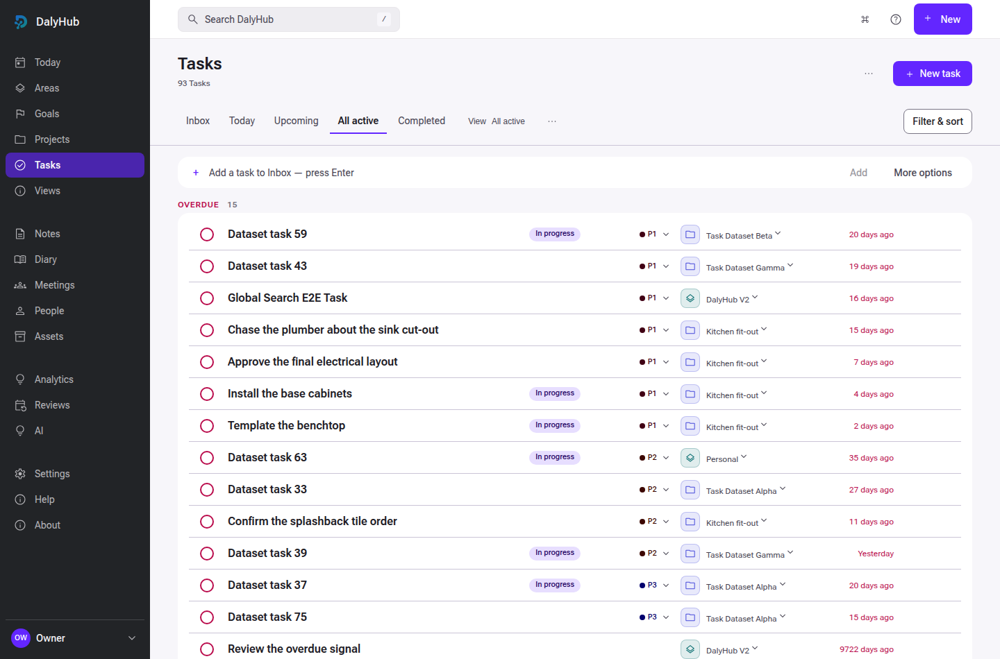 | 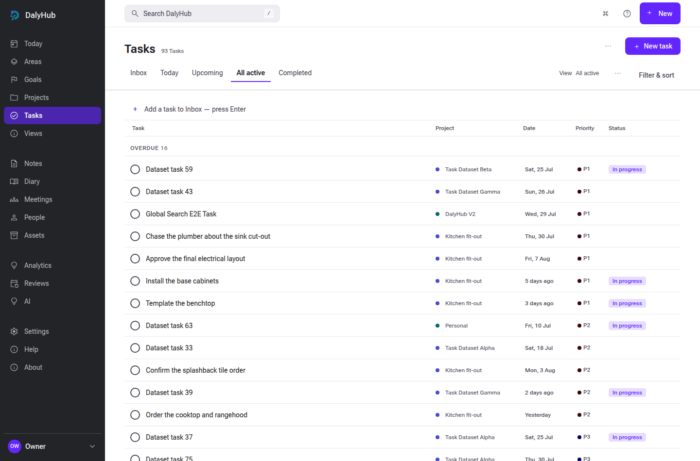 |

**What changed**

- The list stopped being a bordered, rounded panel on a grey page. Rows are drawn
  on a **white workspace** separated by hairlines — the concept's ground for a
  flat list.
- A **column grid with a header** (`Task · Project · Date · Priority · Status`)
  replaced a right-aligned metadata run. Dates and project names now start on the
  same x down the whole list.
- **Project** is an identity dot and a name, not a 24px bordered tile with a
  chevron. **Due** is `Sat, 25 Jul` in ordinary text, not `20 days ago` in
  crimson. **Priority** is the priority's own dot and its tag, with no container.
- The **status pill is the only bounded coloured container left on a row.**
- The header band lost a line: the count sits beside the title instead of under
  it, which is ~30px of the calmest band on the page returned to the list.
- Quick capture became the row above the first task rather than a filled card.
- The group heading is muted small caps with a tabular figure and a rule, not
  crimson uppercase.

**Still different from the concept**

- The concept's row carries a drag handle; DalyHub's task order is a server sort
  and there is nothing to drag it into, so the column is not drawn.
- The concept's view switcher (List / Board / Calendar / Timeline) sits beside
  the title; DalyHub's three presentations are in the header's overflow, which is
  where UIX-01 put a decision made once a week.
- The concept draws `Filter` and `Sort` as two ghost buttons in the title row;
  DalyHub has one "Filter & sort" control at the end of the tab row, because one
  shared sheet carries all sixteen filter dimensions at every width (TASKS-03).
- The concept has no group headings — it shows one flat scope at a time. DalyHub
  groups by due state, which is a real feature and not a difference to close.

## 2. Density at laptop widths

| 1366 | 1920 |
|---|---|
| 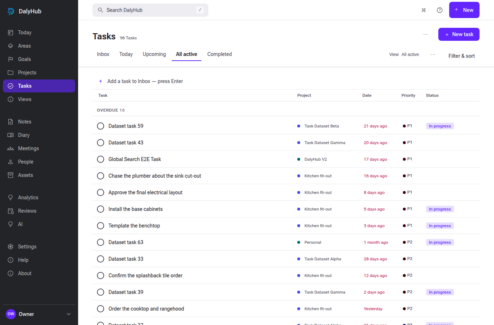 | 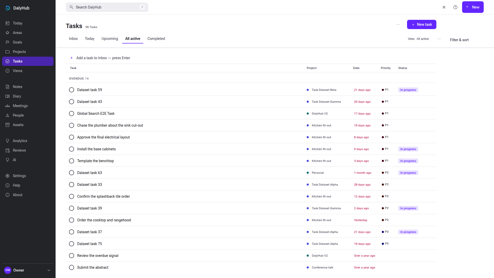 |

The row is the completion control's 45px target with no padding on top of it, and
the header band lost a line, so a 1366×900 laptop shows meaningfully more of the
list than it did. At 1920 the metadata columns stay fixed and the title takes the
extra width — metadata does not spread.

## 3. The phone (Concept A, "Tasks (Mobile)")

| Baseline 390 | Final 390 | Final 320 |
|---|---|---|
| 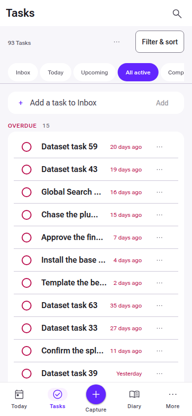 | 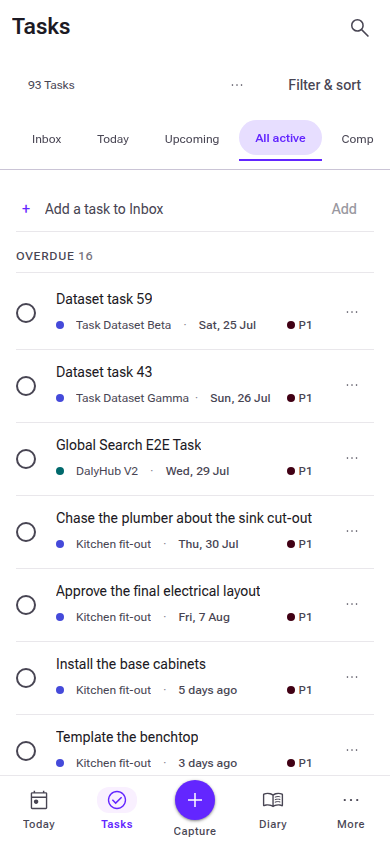 | 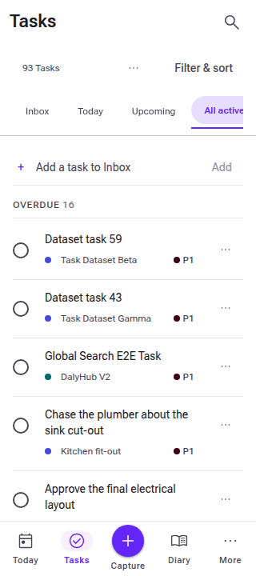 |

**What changed**

- The row is **recomposed, not squeezed**: title on line one with the full width,
  `● Project · Date` and the priority on line two. Titles are no longer cut to
  fourteen characters, and project and priority are no longer dropped entirely.
- The scope tabs are quiet text with a **pale accent capsule and an underline**
  for the current one, instead of solid purple pills running off the edge.
- No carets are drawn where there is no hover to reveal them; the value itself is
  the target, at the 44px floor.

## 4. Dark

| Baseline | Final |
|---|---|
| 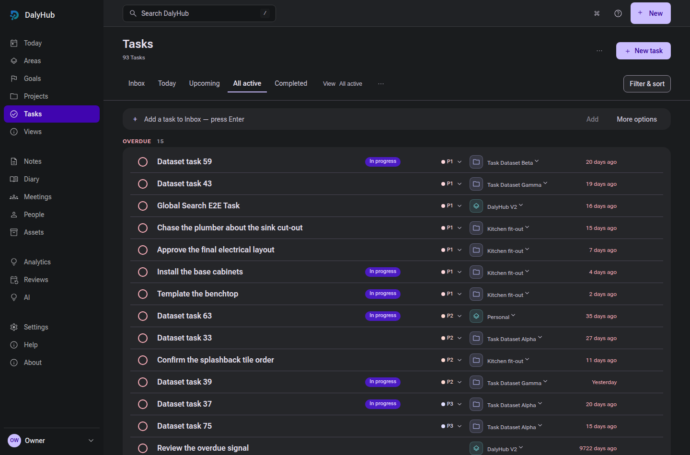 | 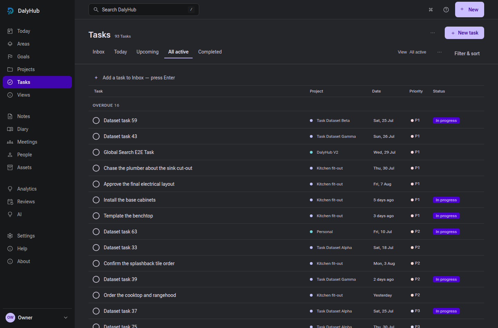 |

The workspace takes the raised surface rather than the page's sunken one, so the
dark rail reads as a frame around a distinctly lighter working surface instead of
disappearing into it. Dividers, hover, selected, metadata and the status pill were
all re-checked in dark; the eight-pass axe sweep covers both appearances.

## 5. Row states

| Normal | Hover | Long title | Overdue | Completed |
|---|---|---|---|---|
|  | 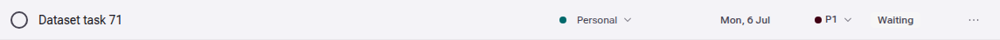 |  | 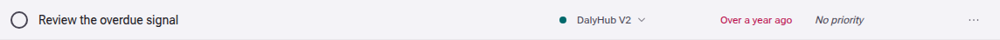 |  |

The overdue row's **completion ring is not crimson**. The date says the task has
slipped and the heading above says Overdue; a third, larger, colour-only
restatement on the control that finishes the task is alarm rather than
information. The completed row is muted and struck, and is not dimmed with
opacity — a 0.72 layer over the muted role composites below 4.5:1.

## 6. Selectors

| Priority | Project | Date |
|---|---|---|
| 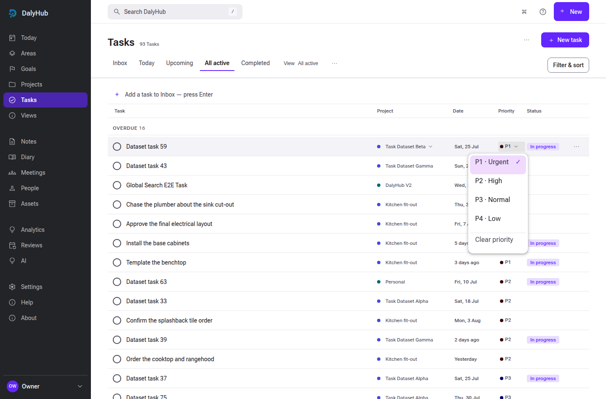 | 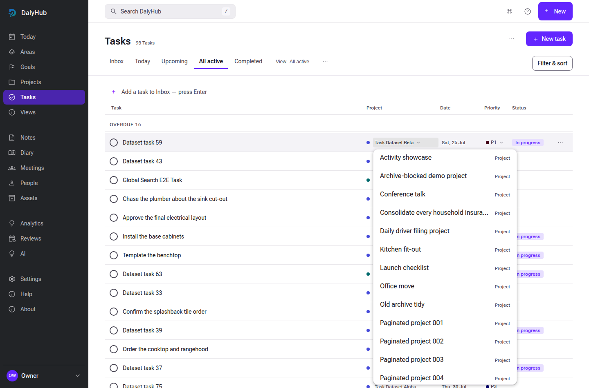 | 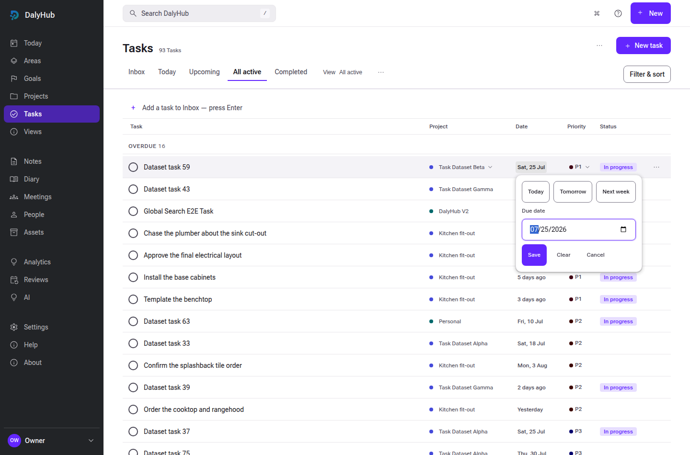 |

Baseline for comparison: [`baseline/project-selector.png`](baseline/project-selector.png)
— fifty candidates at 59px each, wrapping to three lines, in a menu the width of a
176px column.

Now: one line per option at the menu rung, so ~14 are visible instead of ~5; the
current value carries a tick as well as `aria-checked`; and the menu ends with
**Search all Projects and Areas…**, which hands off to the shared searchable
picker over the whole workspace.

## 7. Quick capture and selection

| Desktop | Mobile | Bulk selection |
|---|---|---|
| 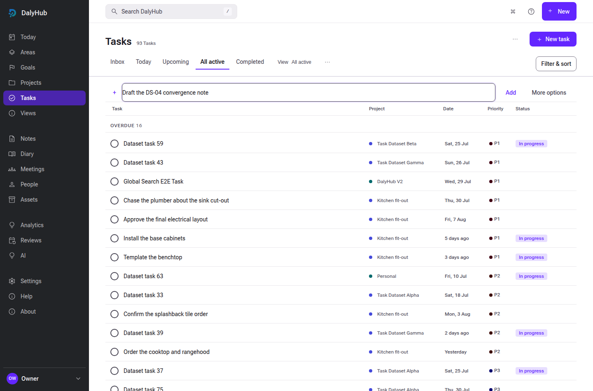 | 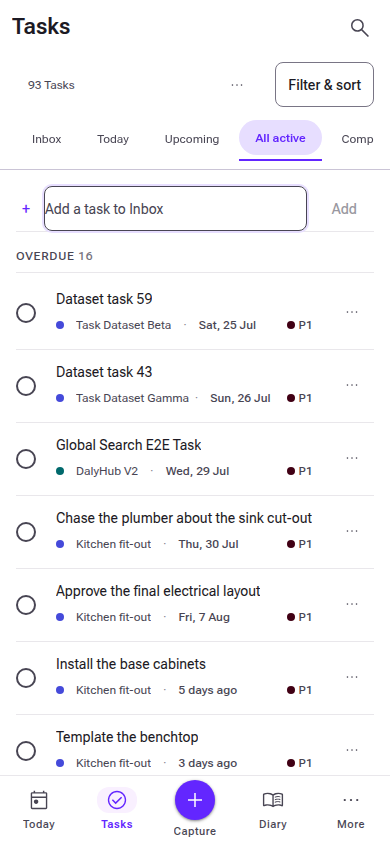 | 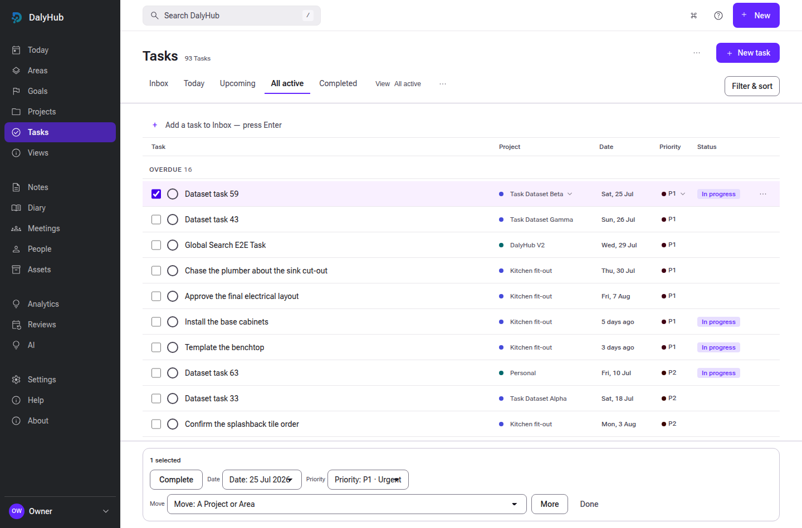 |

## 8. The Task Drawer

| Baseline | Final light | Final dark |
|---|---|---|
| 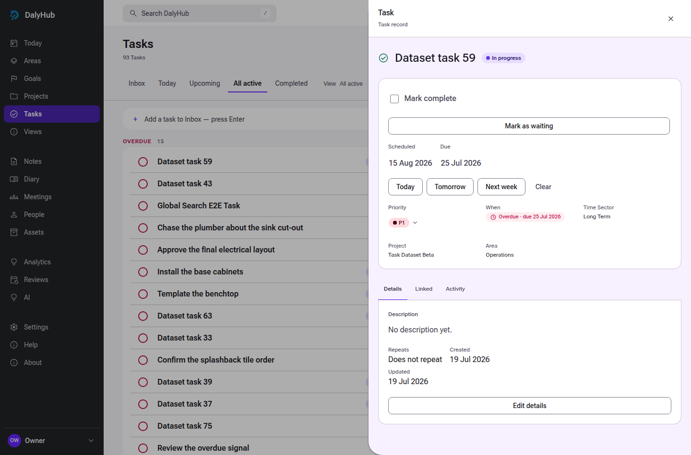 | 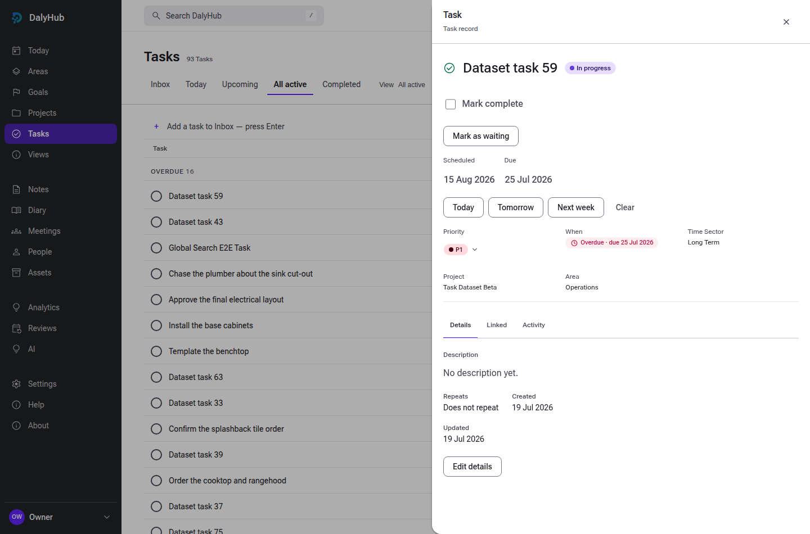 | 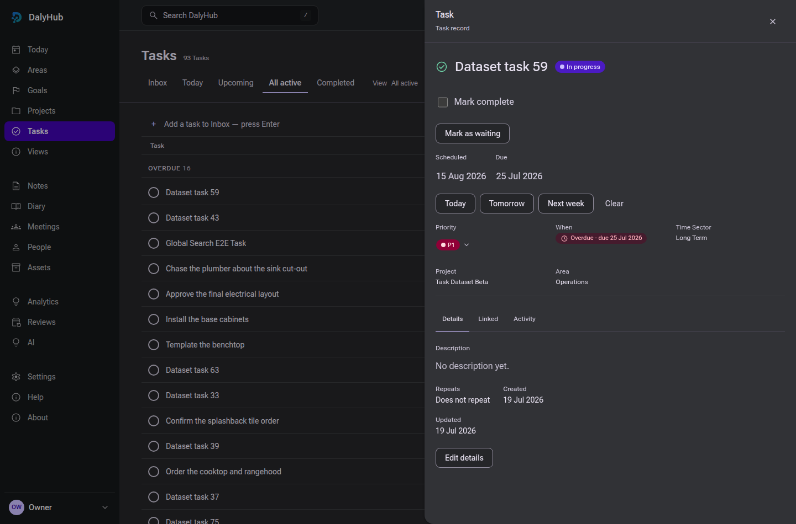 |

The lavender wash is gone — product-wide, because a generated tonal step resolved
to `#f7f1ff` under every record in the product. The two nested white cards became
hairline-separated bands, the full-width outlined buttons became buttons the size
of their words, and the panel's radius came down from 28px.

## 9. Cross-module regression

| Today | Projects |
|---|---|
| 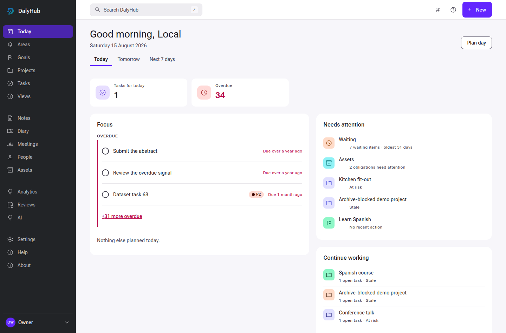 | 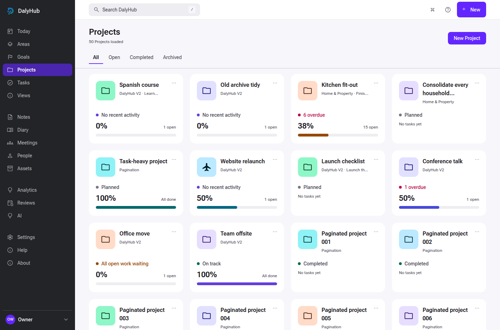 |

Both still render the generic `Card` and are unchanged in structure. What changed
for them is what changed product-wide: the drawer surface, the phone tab rail's
capsule, and dates further back than a week reading as a date rather than a
count-up. Recorded as [DEBT-128](../../../product/PRODUCT_DEBT.md).
